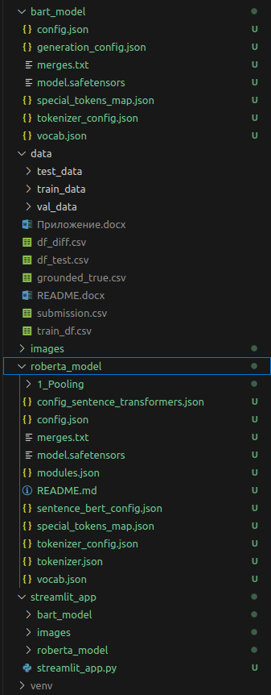

## Инструкция

установки зависимостей и запуска кода ноутбуков

Версия Python - **3.10.12**
Среда разработки

- Kernel: 5.15.0-122-generic x86_64 bits: 64 compiler: gcc v: 11.4.0
- Desktop: Cinnamon 6.0.4
- tk: GTK 3.24.33 wm: muffin vt: 7 dm: LightDM 1.30.0 Distro: Linux Mint 21.3 Virginia
- base: Ubuntu 22.04 jammy

IDE - VS Code

Что касается Linux, то здесь venv далеко не всегда входит в пакет операционной системы, поэтому может потребоваться его установить. На Ubuntu/Debian это делается следующей командой:
`sudo apt install -y python3-venv`
Некоторые пакеты Python требуют сборки из исходных кодов, поэтому также может потребоваться установка следующих пакетов:
`sudo apt install -y build-essential libssl-dev libffi-dev python3-dev`

1. Скачать/склонировать репозиторий rutube

- выполнить в терминале команду `git clone https://github.com/RuslanLat/atom`

2. Активировать/создать виртуальную среду

- выполнить в терминале команду `python3 -m venv venv`
- активировать виртуальную среду `source venv/bin/activate`

Пример отображения активированной виртуальной среды - `(venv) ruslan@ruslat:~/ratom$`

3. Установить зависимости

- выполнить в терминале команду `pip install -r requirements.txt`

4. Запустить ячейки ноутбука

- скачать/перенести исходные данные по задаче в папку **data**
- [скачать](https://disk.yandex.ru/d/QpSFFa6r8V_0aQ) веса моделей и поместить в папку **bart_model** и **roberta_model**
- при запуске выбрать ранее созданную виртуальную среду
- запустить поочередно ячейки ноутбука

5. Запуск Web интерфейса

- выполнить в терминале команду `streamlit run streamlit_app/streamlit_app.py`

**_Примечание_** - примерс структуры папки **data**, **bart_model** и **roberta_model**

